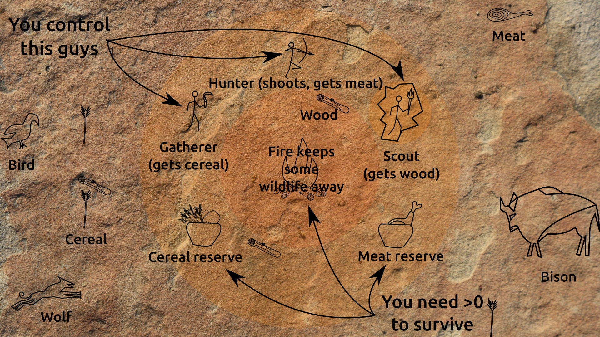

# Pain in the Cave

## Ludum Dare 36: Ancient Technology

So what tech is more ancient than "rendering" on cave walls? None, I bet!

The tribe is diminishing, only a Hunter, a Gatherer and a Scout
remain. To survive, they must feed the fire with wood to remain warm and
safe, hunt and gather themselves a healthy dose of prehistoric
proteins and carbohidrates and avoid being eaten by wolves, ran down
by bisons and annoyed by birds that steal their crops...

## Controls
- Click on tribemen to select them, and then click on a target resource to
collect it (Hunter->Meat, Gatherer->Cereal, Scout->Wood), on an animal
to attack it (Hunter), or anywhere to move (All).
- Actions cannot be interrupted, so use your 21st century brain to
plan ahead your actions in the -100th

## Notes
- Prefer FullScreen, as art is 1920x1080 with no resizing (sorry:_)
- Web play using love.js (https://github.com/TannerRogalsky/love.js)
- Offline play requires LÖVE (>= 0.10.1), run from the game directory as "love ."
- Developed in Ubuntu 14.04, but "should" work wherever there's LÖVE.
- Source included in the .zip, no license, do whatever you feel like with it.
- Song "Krakatoa" Joseph Gilbert / Kistol (through http://opengameart.org/)

[Postmortem](Postmortem.md)
